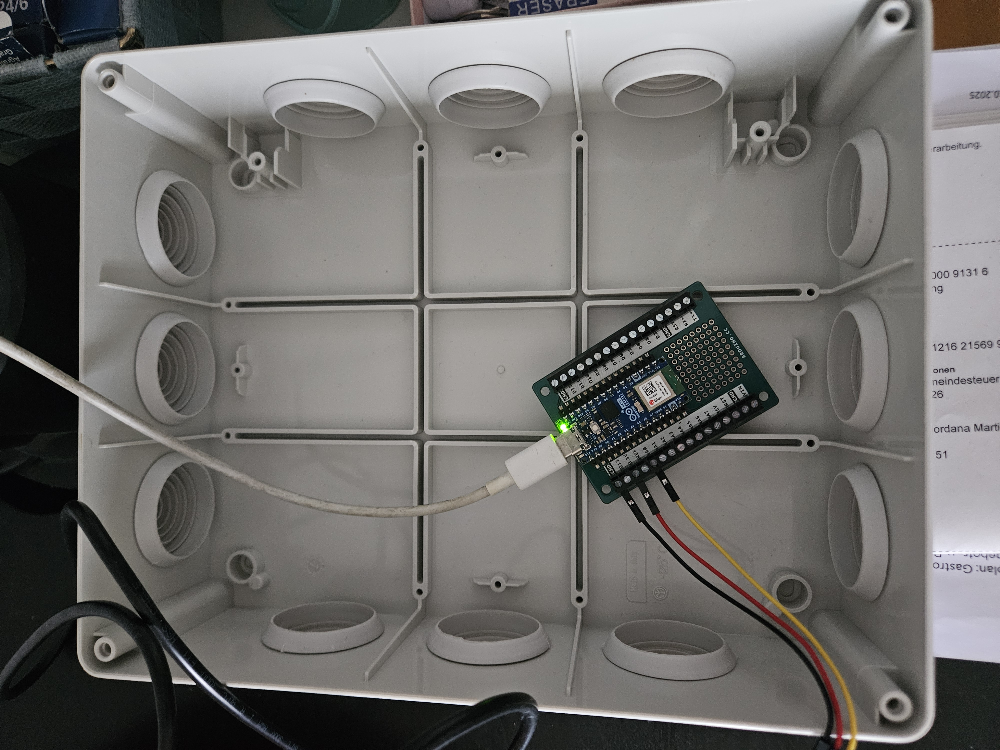
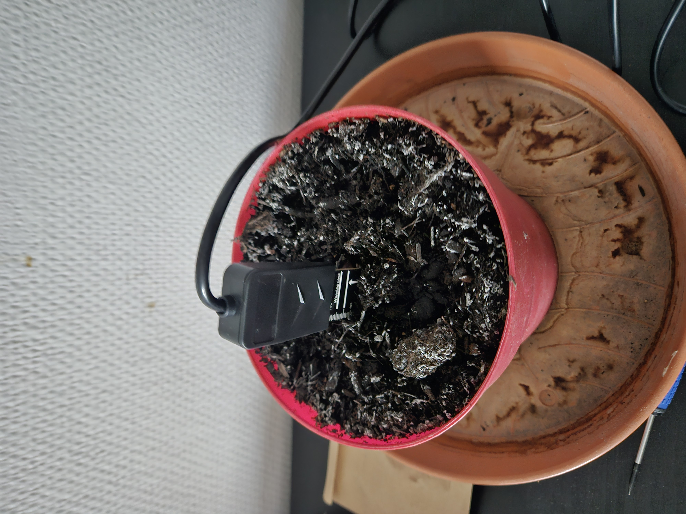
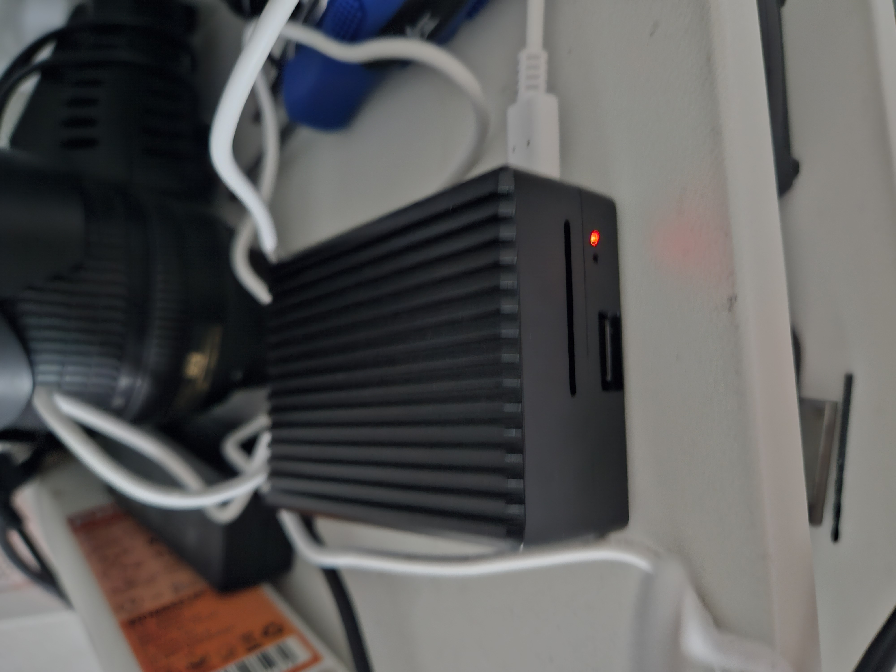

🌱 GardenHUB – Autonomous IoT Watering System
---
A real-world IoT automation system designed to manage irrigation for a ~70 m² home garden using sensor-driven logic, weather integration, and a Raspberry Pi backend.

This project combines:

- Software engineering
- Electronics & wiring
- IoT communication
- Data logging & future ML experimentation
- Automation logic design


It is both a functional irrigation system and an evolving engineering project.

---

## 📸 System Preview

### Control Box (Arduino Nano ESP32 Node)



### Soil Moisture Sensor (Test Setup)



### Raspberry Pi Controller



---

## Context

**Location**: Designed for a ~70 m² residential garden in Central Europe.

**Infrastructure**:

7 raised beds

Greenhouse

Fruit trees

Mediterranean herb patch

Pots & strawberry section


The system supports seasonal vegetable production (salads, tomatoes, onions, garlic, broccoli, potatoes, etc.) with controlled and automated irrigation.


---

## Project Goals

### Phase 1 – Functional Automation (Current)

Sensor-based moisture monitoring

Multi-zone watering control

Web interface for monitoring & manual control

Weather integration

Historical logging in SQLite

Reliable data ingest from ESP32 nodes


### Phase 2 – Robust IoT Architecture

Improve communication reliability

Health monitoring of nodes

Better scheduling & fault tolerance

Expand to 6 watering zones


### Phase 3 – ML-Assisted Irrigation

Use historical moisture, weather, and watering events

Optimize watering duration

Improve water efficiency

Extend architecture to controlled environments (e.g., mushroom chambers)

---

## 🚧 Current Status

The system is currently in an active development and stabilization phase.

Working components:
- Sensor → Raspberry Pi data pipeline
- SQLite data storage
- Watering decision engine (dry-run mode)
- Web UI for monitoring and manual triggering
- Weather data integration

Ongoing work:
- Backend refactoring (modular architecture)
- Improved reliability and error handling
- Preparation for real valve control (currently disabled)

The system has completed a multi-week real-world test cycle in a home garden environment.

---

## System Architecture

### Central Controller

Raspberry Pi 4B

Raspberry Pi OS (64-bit)

Python 3

Flask backend

SQLite database


### Sensor Nodes

Arduino Nano ESP32

Wi-Fi communication (HTTP POST → Flask)

DFRobot Waterproof Soil Moisture Sensor v2.0 (capacitive)


### Irrigation Control

24V AC solenoid valves (Hunter / RainBird – TBD)

Relay module control

Planned expansion: up to 6 zones

Current test stage: 2–3 zones, 4–6 sensors


### Power System

Mains → 24V AC for valves

Mains → 5V DC for Raspberry Pi & ESP32

Relay isolation for valve actuation

---

### Design Principles

- Reliability over complexity
- Fail-safe behavior (no watering on missing data)
- Incremental automation (manual → assisted → autonomous)
- Real-world testing before full deployment

---

### Software Stack

Backend: Python + Flask

Database: SQLite

Communication: HTTP POST (future: MQTT)

Weather API: Open-Meteo

Scheduler: standalone Python process (morning execution window)


Plant configuration: JSON-based profiles

Automation engine: custom watering logic module

Planned: ML pipeline for predictive irrigation

## Data & Observability

GardenHUB logs time-series events in SQLite to support traceability and future analytics:

- sensor_readings (timestamp, node_id, zone, moisture, temp/humidity optional)
- watering_events (timestamp, zone, duration, reason/manual/auto)
- weather_snapshots (timestamp, forecast/rain probability/temp)
- system_health (node last_seen, error counts — planned)

This data model supports:
- historical trend analysis
- watering effectiveness evaluation
- future ML features (predictive duration / anomaly detection)

---

### Repository Structure (pre-refactor)
```
.
├── app.py                  # Flask entrypoint
├── db.py                   # SQLite connection handler
├── db_schema.py            # Database schema definitions
├── db_init.py              # Table initialization
├── repositories.py         # Data access layer
├── watering_engine.py      # Core watering decision engine
├── watering_decision.py    # Threshold & decision logic
├── garden_logic.py         # Moisture interpretation logic
├── get_weather_new.py      # Weather ingestion
├── historic_weather.py     # Weather history queries
├── python_receiver.py      # Sensor ingest endpoint
├── plants/                 # Plant configuration (JSON)
├── templates/              # Flask templates
├── static/                 # CSS
├── dev_tests/              # Experimental scripts (no secrets)
└── arduino_secrets.example.h
```

---

### Security & Configuration

Secrets are not stored in the repository.

Arduino credentials go in:
```
arduino_secrets.h
```
(ignored via .gitignore)

Template provided:
```
arduino_secrets.example.h
```
Python API keys should be stored in environment variables (.env not committed).


---

### Quick Start (Raspberry Pi)

**1️⃣ Install system dependencies**
```
sudo apt update
sudo apt install -y git python3-venv python3-pip sqlite3
```
**2️⃣ Clone the repository**
```
git clone https://github.com/Katolux/Watering-System.git
cd Watering-System
```
**3️⃣ Create virtual environment**
```
python3 -m venv .venv
source .venv/bin/activate
pip install -r requirements.txt
```
**4️⃣ Run the application**
```
python3 app.py
```
Access from another device on the same network:
```
http://<RASPBERRY_PI_IP>:5000
```

---

## Project Scope

This is a physical irrigation system deployed in a real garden environment.

The system includes:

Live sensor ingestion

Backend decision logic

Historical data storage

Weather-based logic

Expandable hardware architecture


The project focuses on backend systems, automation logic, and applied IoT engineering.


---

## Roadmap

- [x] Basic sensor ingest

- [x] Database logging

- [x] Web UI for monitoring

- [x] Manual watering trigger

- [ ] Hardware valve control integration

- [ ] MQTT-based communication

- [ ] Node health monitoring

- [ ] Predictive ML irrigation model

- [ ] Mushroom growth chamber integration


---

## Author

Alfonso Gómez-Jordana
Switzerland 🇨🇭

Background in operations and technical systems.
Currently focused on backend development and IoT automation.

GitHub: @Katolux


---

If you'd like feedback, collaboration, or discussion around IoT architecture, automation logic, or applied ML in small-scale agriculture, feel free to connect.


---
